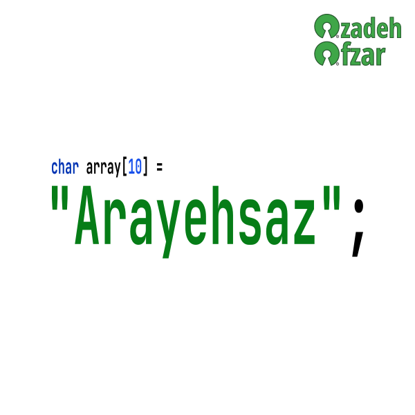

   
  

<h1 align="center">Arayehsaz</h1>
<h3 align="center">Easy and almost safe dynamic arrays in C.</h3>

    Arayehsaz is an open source C library, it helps you create powerful dynamic arrays  
    in your programs and forget about leaking memory! well as long as you remember to free().

  
  
  

   

  
  
  
  
   

> If you are viewing this repository on GitHub, this GitHub repository is a mirror of the **Arayehsaz**,
> the main repository is served on 
><a href="https://gitlab.com/Azadeh-Afzar/Utility-Development/Arayehsaz">GitLab</a>, all developments and
>discussions, issue tracking and merge requests take place in GitLab.  

